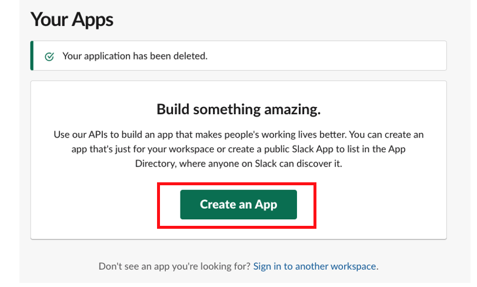
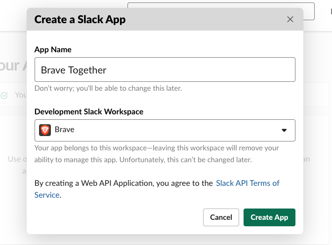
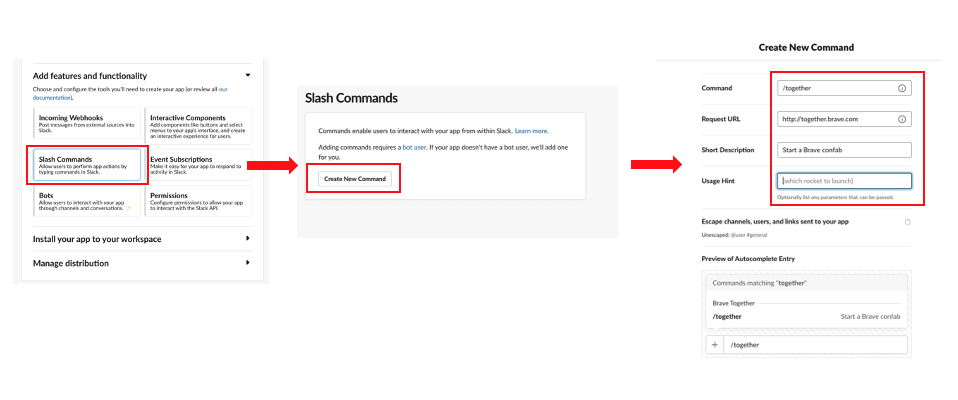

# Jitsi Slack - Jitsi Meet Integration for Slack

This project provides a Slack integration to enable starting video conferences
from Slack and easily inviting Slack members to conferences.

Enables starting and joining [Jitsi Meet](https://meet.jit.si) meetings from within [Slack](https://slack.com/)

## Getting Started

These instructions will get you started with the ability to run the project
on your local machine for development purposes.

### Prerequisites

#### Go

A working setup for the Go Programming Language is needed. Here is a [getting started](https://golang.org/doc/install) guide. The project
is currently using go version 1.11 along with module support.

#### AWS

The application leverages DynamoDB to store session tokens and server configuration. You would need access to an AWS environment and the CLI. 

#### Slack

A slack account needs to be created as well as an [app](https://api.slack.com/apps). The app created is intended for development
purposes.

1. Go to <https://api.slack.com/apps>

   Click on `Create New App` and enter this information:

        App Name: Brave Together
        Development Slack Workspace: Brave Software

    Click on `Create App`
    
    

    

2. Under `Add features and functionality`  Click on `Slash Commands`, click on `Create New Command`, and enter this information:

        Command: /together
        Request URL: http://together.brave.com:.../slash/jitsi
        Short Description: Start a Brave confab

    Click on `Save`




3. Click on `OAuth & Permissions`, under `Bot Token Scopes` in addition to `commands`, add these by clicking `Add an OAuth Scope`:

    - incoming-webhook
    - chat:write
    - im:read
    - im:write
    - mpim:read
    - mpim:write

4. Scroll up and click on `Install App to Workspace`. Under `Where should "Brave Together" post?` select `Slackbot`


## Configuration

```bash
    SLACK_SIGNING_SECRET=<signing secret of slack app>
    SLACK_CLIENT_ID=<client id of slack app>
    SLACK_CLIENT_SECRET=<client secret of slack app>
    SLACK_APP_ID=<slack app id>
    SLACK_APP_SHARABLE_URL=<slack app url for sharing install>
    TOKEN_TABLE=<dynamodb table name for storing oauth tokens>
    DYNAMO_REGION=<dynamodb region used>
    JITSI_TOKEN_SIGNING_KEY=<key used to sign conference asap jwts>
    JITSI_TOKEN_KID=<key identifier for conference asap jwts>
    JITSI_TOKEN_ISS=<issuer for conference asap jwts>
    JITSI_TOKEN_AUD=<audience for conference asap jwts>
    JITSI_CONFERENCE_HOST=<conference hosting service i.e. https://meet.jit.si
    TOKEN_TABLE_CONFIG=<json file that describes the dynamo_db token table>
    SERVER_TABLE_CONFIG=<json file that describes the dynamo_db server table>
```

## Development

Features are being worked on that assist with local development that remove the need for dynamodb and support a developer's Slack workspace.

## Running

Clone this project and run with `./set-up.sh`

## Dependency Management

Dependency management for this project uses go module as of go version 1.11. More information can be found at [go command documentation](https://golang.org/cmd/go/#hdr-Modules__module_versions__and_more).

## Versioning

This project uses [Semantic Versioning](https://semver.org) for the code and associated
docker containers. Versions are tracked as [tags](https://github.com/jitsi/jitsi-slack/tags) on this repository.

## License

This project is licensed under the Apache 2.0 License [LICENSE](LICENSE)
